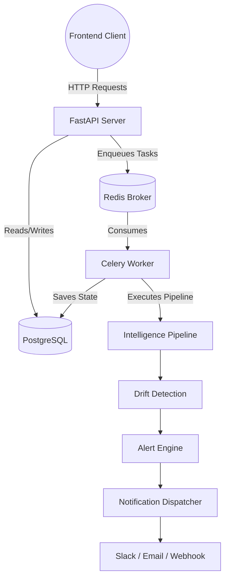

# Competitor Intelligence Monitor (CIM)
## Frontend Development Context

---

# SECTION 1 — Executive Summary

**What the product currently does:**
The Competitor Intelligence Monitor (CIM) is an automated system that extracts, analyzes, and compares strategic intelligence from competitor websites. It scrapes content, processes it via an LLM (OpenRouter) to extract momentum scores, messaging tone, and ICP details, detects drifts over time, and triggers notifications via configured channels (Slack, Webhook, Email).

**Current backend maturity:**
The backend is highly mature and feature-rich. It features asynchronous task queues (Celery), a robust relational database layer (PostgreSQL with SQLAlchemy), extensive telemetry (Prometheus), and RESTful APIs via FastAPI.

**Current release tag:**
v2.3.0

**Production readiness status:**
Production-ready backend. Monitoring, persistence, metrics, authentication, and background processing are fully implemented.

**Major capabilities already implemented:**
- User Authentication (JWT)
- Watchlist Management (Competitors & Monitoring Schedules)
- Intelligence Pipeline (Scraping, Retrieval, LLM Analysis, Synthesis)
- Drift Detection & Alert Engine
- Notification Channels & Dispatching
- Dashboard Metrics & Activity Aggregation

---

# SECTION 2 — Full Repository Tree

```bash
├── Dockerfile
├── Dockerfile.worker
├── README.md
├── alembic/
│   ├── env.py
│   └── versions/
├── alert_runs/
├── backend/
│   ├── api/
│   │   ├── auth.py
│   │   ├── dashboard.py
│   │   ├── notifications.py
│   │   └── watchlists.py
│   ├── auth/
│   │   ├── dependencies.py
│   │   └── service.py
│   ├── celery_app.py
│   ├── config.py
│   ├── database/
│   │   ├── connection.py
│   │   ├── db_service.py
│   │   └── models.py
│   ├── drift/
│   │   ├── alert_engine.py
│   │   ├── monitoring_service.py
│   │   └── suppression_service.py
│   ├── eval/
│   ├── main.py
│   ├── metrics.py
│   ├── models/
│   │   └── schemas.py
│   ├── monitoring/
│   │   └── schedule_service.py
│   ├── notifications/
│   │   ├── channels/
│   │   └── service.py
│   ├── prompts/
│   ├── reasoning/
│   ├── retrieval/
│   ├── services/
│   ├── tasks.py
│   └── utils/
├── docker-compose.yml
├── evaluation_baselines/
├── frontend/
├── images/
├── k8s/
├── monitoring/
│   ├── grafana/
│   └── prometheus/
├── pyproject.toml
├── pytest.ini
├── requirements.txt
└── tests/
```

**Key Directories:**
- `backend/api/`: FastAPI route definitions consumed by the frontend.
- `backend/auth/`: JWT handling, password hashing, and user dependencies.
- `backend/database/`: SQLAlchemy models and data access layer (`db_service.py`).
- `backend/drift/`: Logic for detecting changes between intelligence runs and generating alerts.
- `backend/eval/`: Evaluation frameworks to grade the quality of extracted LLM intelligence.
- `backend/models/`: Pydantic schemas validating all API inputs and outputs.
- `backend/monitoring/`: Grafana dashboards and Prometheus alerting rules.
- `backend/notifications/`: Notification channel handlers (Slack, Email, Webhook).
- `backend/reasoning/`: Agentic workflow modules for parsing ICP, tone, and momentum.
- `backend/retrieval/`: Scraping, chunking, and semantic routing logic.
- `backend/services/`: Core orchestration services (ScraperService, AnalysisService, ComparisonService).
- `tests/`: Comprehensive unit test suite.

---

# SECTION 3 — Backend Architecture Overview

## High Level Architecture



**Components:**
1. **FastAPI**: Synchronous REST API providing routes for Auth, Dashboard, Notifications, and Watchlists.
2. **PostgreSQL**: Primary transactional database containing users, watchlists, runs, and alerts.
3. **Redis**: Message broker for Celery and caching layer.
4. **Celery Worker & Beat**: Executes long-running monitoring tasks asynchronously and triggers scheduled runs.
5. **Monitoring Pipeline**: Crawls websites, extracts text, calls LLM agents, and synthesizes reports.
6. **Notification Dispatcher**: Evaluates generated alerts against user channels and suppressed alerts.

---

# SECTION 4 — Current Data Flow

## User Signup
1. Frontend calls `POST /api/auth/signup`
2. Backend verifies email uniqueness
3. Backend hashes password and creates `User` record
4. Backend generates JWT access token
5. Returns `AuthResponse` with token and user ID.

## User Login
1. Frontend calls `POST /api/auth/login`
2. Backend looks up user by email
3. Validates password against hash
4. Updates `last_login_at`
5. Returns `AuthResponse` with JWT token.

## Watchlist Creation
1. Frontend calls `POST /api/watchlists` with Bearer token.
2. Token verified via `get_current_user` dependency.
3. Backend creates `Watchlist` tied to user.
4. Returns `WatchlistResponse`.

## Competitor Addition
1. Frontend calls `POST /api/watchlists/{id}/competitors`
2. Backend verifies watchlist ownership
3. Adds `WatchlistCompetitor` uniquely linked to watchlist
4. Returns `CompetitorResponse`.

## Monitoring Run Execution
1. Frontend calls `POST /api/watchlists/{id}/runs` or Celery Beat triggers schedule.
2. `MonitoringRun` record is created in `QUEUED` status.
3. Celery task `monitor_watchlist_task` is dispatched to Redis.
4. Task worker updates status to `RUNNING`.
5. For each competitor in the watchlist:
    - Scrape domains using ScraperService.
    - Extract signals via AnalysisService.
    - Generate report via ComparisonService.
    - `MonitoringService.detect_drift()` identifies shifts.
6. If drift exceeds severity threshold, an `AlertHistory` is generated.
7. Alert matched to User `NotificationChannel`s.
8. Notifications dispatched (e.g. sent to Slack).
9. Run marked `COMPLETED` and stats updated.

---

# SECTION 5 — API Inventory

## Auth Endpoints
### `POST /api/auth/signup`
- **Purpose**: Create a new account.
- **Auth Required**: No
- **Request**: `SignupRequest` (email, password, display_name)
- **Response**: `AuthResponse` (access_token, user_id, email, display_name)
- **Used by**: Signup Screen

### `POST /api/auth/login`
- **Purpose**: Authenticate user.
- **Auth Required**: No
- **Request**: `LoginRequest` (email, password)
- **Response**: `AuthResponse` (access_token, user_id, email, display_name)
- **Used by**: Login Screen

### `GET /api/auth/me`
- **Purpose**: Get current profile.
- **Auth Required**: Yes
- **Response**: `CurrentUserResponse` (id, email, display_name)
- **Used by**: Top Navigation / Global Layout

## Dashboard Endpoints
### `GET /api/dashboard/summary`
- **Purpose**: Return aggregate dashboard metrics.
- **Auth Required**: Yes
- **Response**: `DashboardSummaryResponse` (counts for watchlists, competitors, monitoring_runs_today, notification_channels)
- **Used by**: Dashboard Home

### `GET /api/dashboard/recent-runs`
- **Purpose**: Return recent monitoring runs.
- **Auth Required**: Yes
- **Response**: `DashboardRecentRunsResponse`
- **Used by**: Dashboard Home

### `GET /api/dashboard/recent-alerts`
- **Purpose**: Return latest alerts.
- **Auth Required**: Yes
- **Response**: `DashboardRecentAlertsResponse`
- **Used by**: Dashboard Home

### `GET /api/dashboard/activity`
- **Purpose**: Return recent user activity feed.
- **Auth Required**: Yes
- **Response**: `DashboardActivityResponse`
- **Used by**: Dashboard Home

## Watchlist Endpoints
### `POST /api/watchlists`
- **Purpose**: Create watchlist.
- **Auth Required**: Yes
- **Request**: `WatchlistCreateRequest` (name, description)
- **Response**: `WatchlistResponse`

### `GET /api/watchlists`
- **Purpose**: Paginate user watchlists.
- **Auth Required**: Yes
- **Query Params**: `limit`, `offset`
- **Response**: `WatchlistListResponse`

### `POST /api/watchlists/{watchlist_id}/competitors`
- **Purpose**: Add competitor.
- **Auth Required**: Yes
- **Request**: `CompetitorCreateRequest` (company_name, domain)
- **Response**: `CompetitorResponse`

### `GET /api/watchlists/{watchlist_id}/competitors`
- **Purpose**: List competitors.
- **Auth Required**: Yes
- **Query Params**: `limit`, `offset`
- **Response**: `CompetitorListResponse`

### `POST /api/watchlists/{watchlist_id}/runs`
- **Purpose**: Queue a monitoring run.
- **Auth Required**: Yes
- **Request**: `MonitoringRunCreateRequest`
- **Response**: `MonitoringRunResponse`

### `GET /api/watchlists/{watchlist_id}/runs`
- **Purpose**: Get run history.
- **Auth Required**: Yes
- **Response**: `MonitoringRunListResponse`

## Notifications Endpoints
### `POST /api/notifications/channels`
- **Purpose**: Register a notification destination.
- **Auth Required**: Yes
- **Request**: `NotificationChannelCreateRequest`
- **Response**: `NotificationChannelResponse`

### `GET /api/notifications/channels`
- **Purpose**: List user channels.
- **Auth Required**: Yes
- **Response**: `NotificationChannelListResponse`

### `PUT /api/notifications/channels/{channel_id}`
- **Purpose**: Enable/disable a channel.
- **Auth Required**: Yes
- **Request**: `NotificationChannelUpdateRequest`
- **Response**: `NotificationChannelResponse`

### `DELETE /api/notifications/channels/{channel_id}`
- **Purpose**: Delete a channel.
- **Auth Required**: Yes

---

# SECTION 6 — Authentication Architecture

**JWT Flow**: Standard stateless JSON Web Tokens.
- Login/Signup endpoints generate a JWT using the backend's `SECRET_KEY`.
- The token payload contains the `sub` claim (the User ID) and an expiration time.

**Protected Endpoints**: Utilize FastAPI's `Depends(get_current_user)`.

**Auth Middleware**: The `get_current_user` dependency automatically extracts the Bearer token from the `Authorization` header, decodes it, and fetches the `User` from the database. It raises a 401 if invalid or expired.

**Token Storage Expectations**: The frontend is expected to store the token securely in `LocalStorage` and use an Axios Interceptor to attach it to the `Authorization: Bearer <token>` header of every API call.

---

# SECTION 7 — Database Architecture

**Users** (`users`)
- `id` (PK, UUID)
- `email` (String, Unique)
- `password_hash` (String)
- **Used by**: Auth endpoints, Watchlists owner.

**Watchlists** (`watchlists`)
- `id` (PK, UUID), `user_id` (FK to users)
- `name`, `description`, `monitoring_frequency`, `next_run_at`
- **Relationships**: Owns Competitors, Owns MonitoringRuns.

**WatchlistCompetitors** (`watchlist_competitors`)
- `id` (PK, UUID), `watchlist_id` (FK to watchlists)
- `company_name`, `domain`
- **Indexes**: Unique constraint on (`watchlist_id`, `company_name`).

**MonitoringRuns** (`monitoring_runs`)
- `id` (PK, UUID), `watchlist_id` (FK)
- `status`, `competitors_checked`, `alerts_generated`, `celery_task_id`

**NotificationChannels** (`notification_channels`)
- `id` (PK, UUID), `user_id` (FK)
- `channel_type`, `destination`, `enabled`, `verified`

**AlertHistory** (`alert_history`)
- `id` (PK, Autoincrement)
- `company_name`, `severity`, `reasons` (JSON)

---

# SECTION 8 — Dashboard Data Sources

**GET /api/dashboard/summary**
- Uses `func.count()` on `Watchlist`, `WatchlistCompetitor`, `NotificationChannel`, and `MonitoringRun` (where created_at == today).
- Widgets: 4 distinct Metric Cards.

**GET /api/dashboard/recent-runs**
- Selects top N `MonitoringRun` ordered by `created_at.desc()` joined on `Watchlist`.
- Widgets: Data Table or List highlighting status (QUEUED, RUNNING, COMPLETED).

**GET /api/dashboard/recent-alerts**
- Selects top N `AlertHistory` ordered by `created_at.desc()`.
- Widgets: Critical Alert Feed showing severity badges.

**GET /api/dashboard/activity**
- Selects paginated `Watchlist` creation records (dynamically generated in API as activity objects with a `WATCHLIST_CREATED` type).
- Widgets: Timeline/Activity stream.

---

# SECTION 9 — Notification System

**Notification Channels**: Allow users to bind destinations (Email, Slack Webhook, Generic Webhook) to their account.
**Storage**: Stored in `notification_channels` table, linked to `User`.
**Delivery Flow**:
When the monitoring pipeline detects drift:
1. Engine formats the message based on the channel type.
2. HTTP requests or Email dispatch logic are fired asynchronously via `NotificationService`.
3. An audit trail is kept in `NotificationEvent` with delivery status (PENDING, SUCCESS, FAILED).

---

# SECTION 10 — Monitoring & Intelligence Pipeline

- **retrieval/**: Controls web scraping, page classification, semantic text extraction, and chunking.
- **reasoning/**: LLM-powered orchestrators determining ICP (Ideal Customer Profile), messaging tone, and momentum based on retrieved evidence.
- **analysis/**: Ties together reasoning modules into a single `CompetitorAnalysis` profile.
- **drift/**: Compares current `CompetitorAnalysis` vs previous runs. Detects deltas in momentum, tone, pricing signals, and triggers the Alert Engine.
- **eval/**: Development-focused directory running automated benchmarks against the LLM outputs to ensure response quality isn't degrading.

---

# SECTION 11 — Celery Architecture

- **Worker**: Processes background `monitor_watchlist` tasks to offload heavy LLM and scraping workflows from the FastAPI server.
- **Beat Scheduler**: Evaluates `next_run_at` on watchlists according to their `monitoring_frequency` and enqueues tasks periodically.
- **Queues**: RabbitMQ/Redis used as the message broker.
- **Failure Handling**: If a pipeline step throws an exception, the Celery task catches it, logs the error, and marks the `MonitoringRun` as `FAILED` in PostgreSQL so the frontend can reflect the status.

---

# SECTION 12 — Infrastructure

- **Docker Compose**: Orchestrates local dev environment.
- **Prometheus & Grafana**: Hosted on standard ports. Scrapes the FastAPI `/metrics` endpoint to visualize active pipeline runs and API latency.
- **Redis**: Port 6379, used as Celery Broker.
- **Postgres**: Port 5432, primary database.

---

# SECTION 13 — Frontend Requirements

## Required Screens

**Login / Signup**: Forms for credentials. Must handle validation errors and JWT extraction.

**Dashboard**: Default authenticated route. Visualizes the 4 dashboard endpoints (Summary Cards, Recent Alerts, Recent Runs, Activity Timeline).

**Watchlists**: Master view of all paginated watchlists. Contains CTA to "Create Watchlist".

**Watchlist Detail**: Shows metadata, settings (Frequency), and Tabs for:
- **Competitors**: List of tracked competitors, form to add new ones.
- **Monitoring Runs**: Execution history with status badges and manual "Run Now" trigger.

**Notifications**: Settings panel to create, toggle, and delete Slack/Email integrations.

---

# SECTION 14 — Recommended Next.js Architecture

```text
app/
  (auth)/login/page.tsx
  (auth)/signup/page.tsx
  (dashboard)/layout.tsx
  (dashboard)/dashboard/page.tsx
  (dashboard)/watchlists/page.tsx
components/
  ui/       # Shared atomic components (buttons, cards, inputs)
  forms/    # Reusable form logic
features/   # Feature-specific components (e.g. WatchlistTable, AlertFeed)
hooks/      # Custom SWR/React Query hooks (e.g. useUser, useWatchlists)
services/   # Axios/Fetch API wrappers calling the FastAPI backend
lib/        # Utility functions, token management
types/      # TypeScript interfaces generated from backend schemas
```

---

# SECTION 15 — API Types

```typescript
export interface AuthResponse {
  access_token: string;
  token_type: string;
  user_id: string;
  email: string;
  display_name?: string;
}

export interface CurrentUserResponse {
  id: string;
  email: string;
  display_name?: string;
}

export interface WatchlistResponse {
  id: string;
  user_id: string;
  name: string;
  description?: string;
  is_active: boolean;
  monitoring_frequency: string;
  last_monitored_at?: string;
  next_run_at?: string;
  created_at: string;
}

export interface CompetitorResponse {
  id: string;
  watchlist_id: string;
  company_name: string;
  domain?: string;
  is_active: boolean;
  added_at: string;
}

export interface MonitoringRunResponse {
  id: string;
  watchlist_id: string;
  trigger_type: string;
  status: string;
  competitors_checked: int;
  alerts_generated: int;
  notifications_sent: int;
  celery_task_id?: string;
  started_at?: string;
  completed_at?: string;
  created_at: string;
}

export interface DashboardSummaryResponse {
  watchlists: number;
  competitors: number;
  monitoring_runs_today: number;
  notification_channels: number;
}
```

---

# SECTION 16 — Frontend Development Order

- **Sprint 1 (Authentication)**: Axios configuration, Auth Context, Login/Signup, Layout Shell.
- **Sprint 2 (Dashboard)**: Data fetching hooks, Summary cards, Alert feeds.
- **Sprint 3 (Watchlists)**: CRUD interfaces for Watchlists and Competitors.
- **Sprint 4 (Monitoring)**: Run trigger buttons, Run history tables, polling for run status.
- **Sprint 5 (Notifications)**: Forms for adding Webhook/Slack channels.
- **Sprint 6 (Polish)**: Empty states, loading skeletons, error boundaries, deployment.

---

# SECTION 17 — Known Technical Debt

- Real-time WebSockets are not implemented for run progression (relies on frontend polling).
- Deletion logic for watchlists lacks deep cascade deletion warnings on the frontend.
- Alert suppression features exist in the DB (`AlertSuppression`) but lack complete API and frontend exposure.

---

# SECTION 18 — Current Product Roadmap

- **Completed**: Core Intelligence Pipeline, Auth, Notifications, Alerts, Dashboard APIs.
- **In Progress**: Full Next.js Admin Dashboard implementation (this document's purpose).
- **Post-V1**: Granular alert suppression UI, User team hierarchies.
- **V2 Vision**: Fully automated competitive response generation (agents reacting to competitor drift).

---

# SECTION 19 — FRONTEND NON-NEGOTIABLE RULES

1. Never modify backend contracts.
2. Never create mock APIs.
3. Never create placeholder data.
4. Never create fake endpoints.
5. Always use TanStack Query.
6. Always use TypeScript strict mode.
7. Always use shadcn/ui.
8. All pages must be mobile responsive.
9. All API responses must be strongly typed.
10. Frontend must run against localhost:8000 without backend changes.

---

# SECTION 20 — Agent Initialization Instructions

Before writing code:
1. Read `FRONTEND_CONTEXT.md`
2. Read `FRONTEND_IMPLEMENTATION_PLAN.md`
3. Read `cim_frontend_prompt.md`

Then generate:
`IMPLEMENTATION_TODO.md`

Only after the TODO is approved, start coding.

---

# SECTION 21 — Environment Configuration

The following environment variables are required:

```env
NEXT_PUBLIC_API_URL=http://localhost:8000
```
