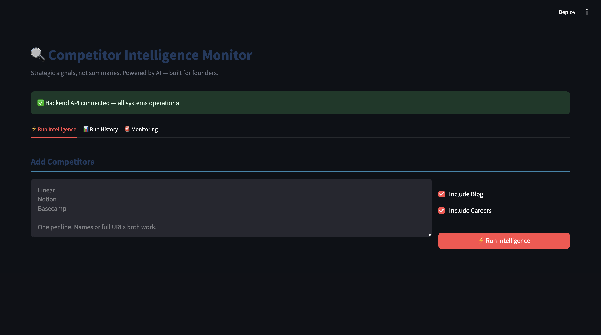
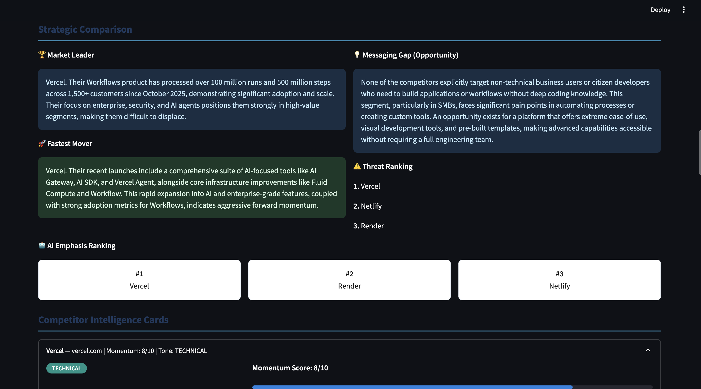
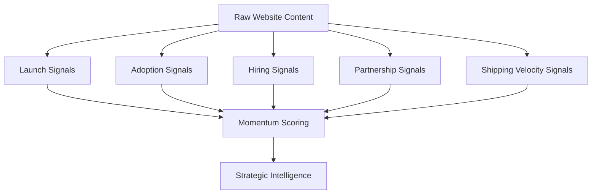
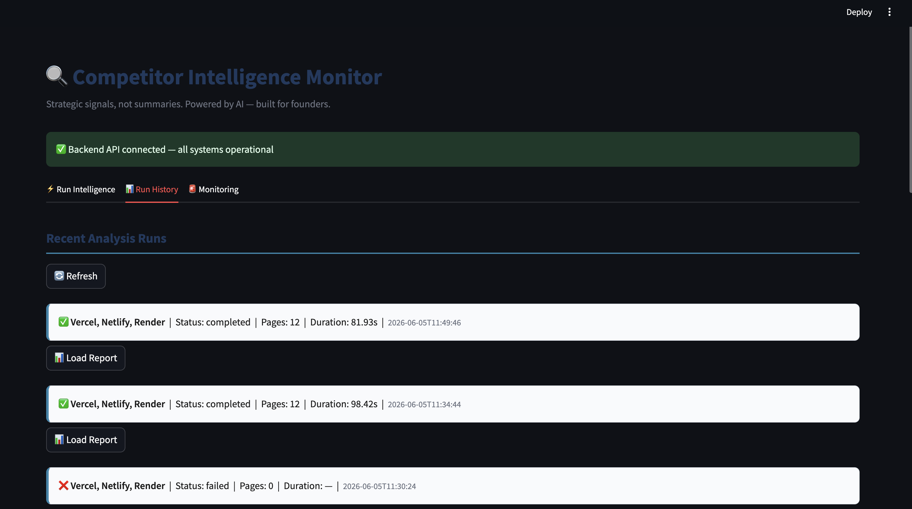
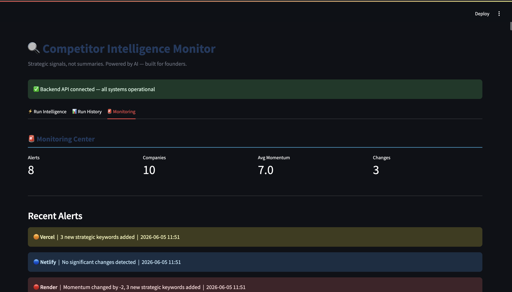
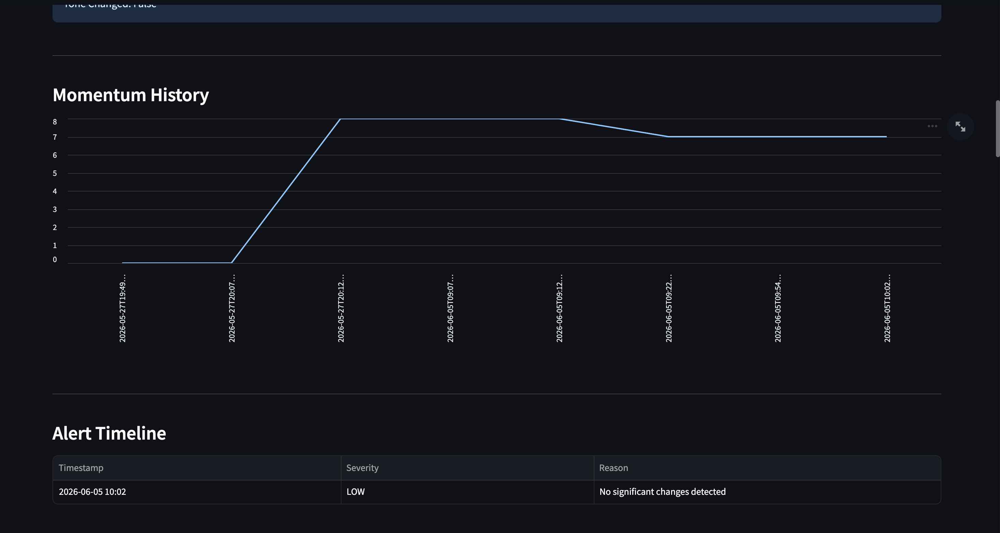

# Competitor Intelligence Monitor (CIM)

Status:
Monitoring Foundation Complete

Current Release:
v0.9.0-monitoring-foundation

Deployment Status:
Preparing First Production Release

Current Capabilities:

* Competitor Analysis
* Strategic Signal Detection
* Competitor Comparison
* Historical Tracking
* Drift Detection
* Alert Generation
* Scheduled Monitoring
* Email Notifications
* Slack Notifications
* Webhook Notifications
* Monitoring Dashboard
* Observability Stack



> AI-Powered Competitive Intelligence Platform for Monitoring Competitors, Detecting Strategic Shifts, and Generating Actionable Business Intelligence.

---

# Overview

Competitor Intelligence Monitor (CIM) is an AI-powered platform that continuously analyzes competitor websites, extracts strategic signals, identifies market movements, and generates structured intelligence reports.

Unlike traditional competitor monitoring tools that only aggregate information, CIM transforms raw competitor activity into strategic insights that can help founders, product managers, sales teams, investors, and business leaders make better decisions.

---

# Why CIM?

Most competitor tools answer:

> What happened?

CIM aims to answer:

> What happened?

> Why did it happen?

> What does it mean?

> What should we do next?

The long-term vision is to evolve CIM into a Competitive Intelligence Copilot that acts as an AI-powered competitive analyst for organizations.

---

# Core Features

## Competitor Analysis



Analyze any competitor website and extract:

* Core Offering
* ICP (Ideal Customer Profile)
* Messaging Tone
* Pricing Signals
* Hiring Signals
* Recent Launches
* Strategic Keywords
* Growth Indicators
* Risk Flags
* Momentum Score
* Analyst Notes

---

## Strategic Signal Detection



Automatically detects:

### Launch Signals

Examples:

* Product launches
* Feature releases
* New offerings

### Adoption Signals

Examples:

* Customer growth
* Revenue growth
* Usage expansion

### Hiring Signals

Examples:

* Engineering hiring
* AI hiring
* Leadership hiring

### Partnership Signals

Examples:

* Integrations
* Strategic partnerships
* Ecosystem expansion

### Shipping Velocity Signals

Examples:

* Changelog updates
* Release frequency
* Product iteration speed

---

## Competitor Comparison



Compare multiple competitors and generate:

* Market Leader Identification
* Fastest Mover Detection
* AI Emphasis Ranking
* Messaging Gap Analysis
* Threat Ranking
* Executive Briefings

---

## Continuous Monitoring

CIM now supports historical intelligence and continuous monitoring.



Features:

- Momentum tracking
- Competitor history
- Drift detection
- Alert generation
- Alert timelines
- Strategic keyword changes
- Historical trend analysis

---

## Alert Engine



The platform automatically generates alerts when:

- Momentum changes significantly
- New strategic keywords appear
- Messaging tone changes
- Competitor positioning shifts

Example:

Render:
- Momentum: 8 → 6
- Added keywords: autoscaling, infrastructure
- Removed keywords: enterprise, automation

Alert Severity:
- LOW
- MEDIUM
- HIGH

---

# Tech Stack

## Backend

* FastAPI
* Python
* SQLAlchemy
* Alembic

## AI Layer

* OpenRouter
* DeepSeek
* Claude
* Structured Prompt Engineering

## Data Layer

* PostgreSQL
* Redis

## Async Processing

* Celery

## Monitoring

* Prometheus
* Grafana

---

# Why This Is Different

Traditional competitor tools:

- Aggregate information
- Surface news
- Require manual interpretation

CIM:

- Extracts strategic signals
- Scores momentum
- Detects drift
- Generates executive briefings
- Produces actionable recommendations

---

# Current Repository Structure

```text
.
├── backend/
│   ├── database/
│   ├── drift/
│   ├── eval/
│   ├── models/
│   ├── prompts/
│   ├── reasoning/
│   ├── retrieval/
│   ├── services/
│   └── utils/
├── frontend/
├── monitoring/
├── tests/
├── docker-compose.yml
├── Dockerfile
└── Dockerfile.worker
```

---

# How CIM Works

## Step 1

User submits competitors:

```text
Stripe
Cursor
HubSpot
```

---

## Step 2

CIM discovers and retrieves:

* Homepage
* Pricing Pages
* About Pages
* Blog Posts
* Customer Stories
* Careers Pages
* Announcements

---

## Step 3

Strategic signals are extracted:

```text
Launches
Hiring
Partnerships
Adoption
Growth
Shipping Velocity
```

---

## Step 4

AI agents generate intelligence:

```text
ICP
Tone
Momentum
Risks
Strategic Observations
```

---

## Step 5

A final competitive intelligence report is generated.

---

# Running Locally

## Clone Repository

```bash
git clone <repo-url>
cd competitor-intelligence-monitor
```

## Create Environment

```bash
python -m venv venv
source venv/bin/activate
```

## Install Dependencies

```bash
pip install -r requirements.txt
```

## Start Services

```bash
docker compose up -d
```

## Run Backend

```bash
uvicorn backend.main:app --reload
```

## Run Frontend

```bash
streamlit run frontend/app.py
```

---

# Benefits

## Founders

Understand:

* Competitor strategy
* Product direction
* Market positioning

Without manually tracking dozens of websites.

---

## Product Teams

Monitor:

* Product launches
* Feature updates
* Pricing changes

and identify roadmap threats early.

---

## Sales Teams

Generate competitive intelligence and battlecard-style insights.

---

## Investors

Track:

* Market shifts
* Emerging competitors
* Growth signals

across an industry.

---

## Strategy Teams

Detect:

* Strategic pivots
* AI adoption
* Enterprise expansion
* Market movement

before they become obvious.

---

# Product Roadmap

Phase 1 — Monitoring Platform
Status: Complete

Features:

* Competitor tracking
* Strategic signal extraction
* Continuous monitoring
* Alerting system
* Historical intelligence

Phase 2 — Intelligence Platform
Status: In Progress

Focus:

* Better business intelligence
* Strategic trend detection
* Competitive positioning insights
* Executive-level reporting
* Faster decision support

Phase 3 — Intelligence Copilot
Status: Planned

Vision:
An AI-powered competitive intelligence assistant capable of helping teams understand market movements, competitive threats, opportunities, and strategic decisions.

---

# Vision

From:

"What happened?"

To:

"Why does it matter?"

And ultimately:

"What should we do next?"

CIM is a strategic intelligence platform designed to transform competitive signals into actionable insights and decision support.

---

# License

MIT License

---

# Author

Ayush Kumar

Machine Learning Engineer | AI Systems Builder | MLOps Enthusiast

LinkedIn: https://www.linkedin.com/in/ayushkumar15/

GitHub: https://github.com/ayushk1233
