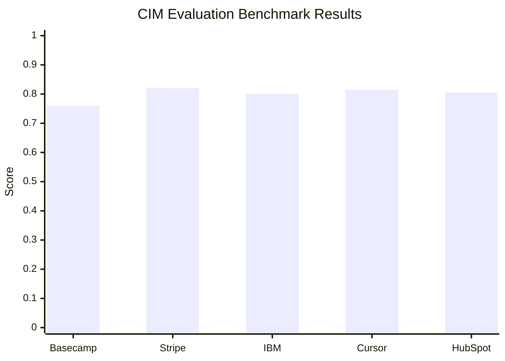
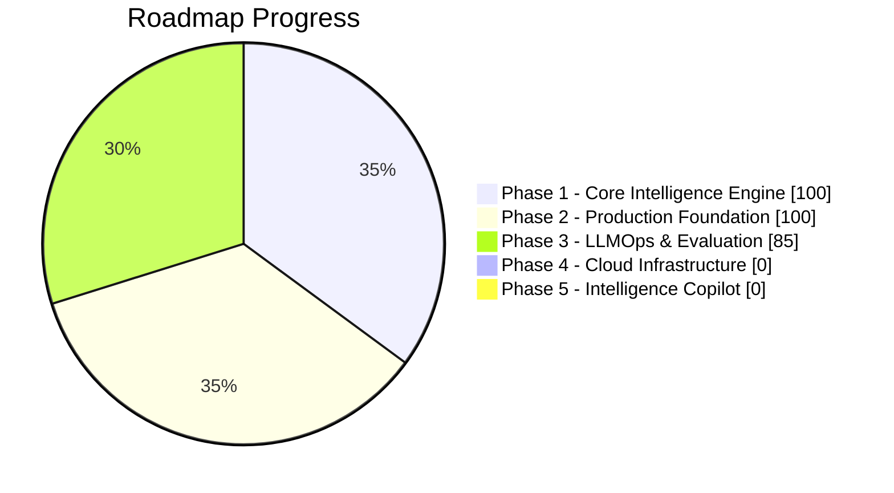
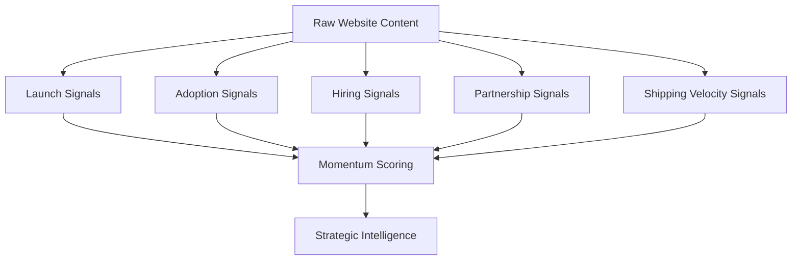
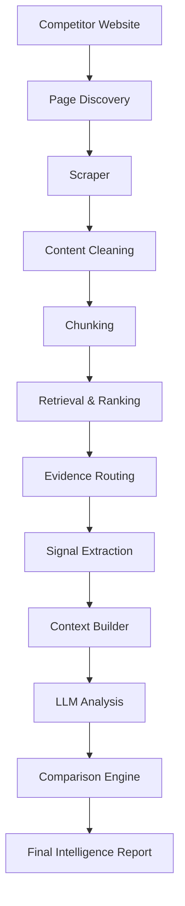
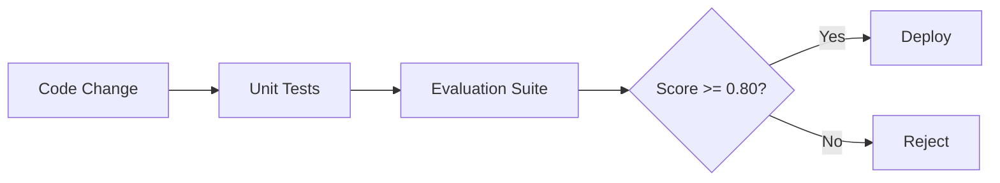
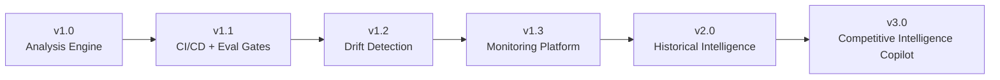
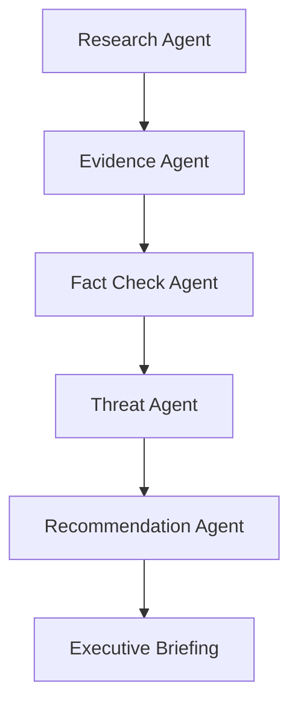
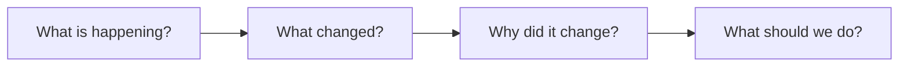

# Competitor Intelligence Monitor (CIM)

> AI-Powered Competitive Intelligence Platform for Monitoring Competitors, Detecting Strategic Shifts, and Generating Actionable Business Intelligence.

---

# Overview

Competitor Intelligence Monitor (CIM) is an AI-powered platform that continuously analyzes competitor websites, extracts strategic signals, identifies market movements, and generates structured intelligence reports.

Unlike traditional competitor monitoring tools that only aggregate information, CIM transforms raw competitor activity into strategic insights that can help founders, product managers, sales teams, investors, and business leaders make better decisions.

---

# Why CIM?

Most competitor tools answer:

> What happened?

CIM aims to answer:

> What happened?

> Why did it happen?

> What does it mean?

> What should we do next?

The long-term vision is to evolve CIM into a Competitive Intelligence Copilot that acts as an AI-powered competitive analyst for organizations.

---

# Current Status

## Version

```text
v1.0-benchmark-0.80
```

## Benchmark Performance



### Overall Benchmark Score

```text
0.800
```

## Project Progress



Evaluation measures:

* Tone Classification Accuracy
* Momentum Detection Accuracy
* ICP Recall
* Strategic Keyword Recall

---

# Core Features

## Competitor Analysis

Analyze any competitor website and extract:

* Core Offering
* ICP (Ideal Customer Profile)
* Messaging Tone
* Pricing Signals
* Hiring Signals
* Recent Launches
* Strategic Keywords
* Growth Indicators
* Risk Flags
* Momentum Score
* Analyst Notes

---

## Strategic Signal Detection



Automatically detects:

### Launch Signals

Examples:

* Product launches
* Feature releases
* New offerings

### Adoption Signals

Examples:

* Customer growth
* Revenue growth
* Usage expansion

### Hiring Signals

Examples:

* Engineering hiring
* AI hiring
* Leadership hiring

### Partnership Signals

Examples:

* Integrations
* Strategic partnerships
* Ecosystem expansion

### Shipping Velocity Signals

Examples:

* Changelog updates
* Release frequency
* Product iteration speed

---

## Competitor Comparison

Compare multiple competitors and generate:

* Market Leader Identification
* Fastest Mover Detection
* AI Emphasis Ranking
* Messaging Gap Analysis
* Threat Ranking
* Executive Briefings

---

## Evaluation Framework

The platform includes a dedicated evaluation framework that measures intelligence quality before deployment.

This allows:

* Prompt experimentation
* Model comparison
* Regression testing
* Quality assurance

The evaluation framework acts as a quality gate for future deployments.

---

# Architecture

## High-Level Flow



---

## Quality Layer



---

# Tech Stack

## Backend

* FastAPI
* Python
* SQLAlchemy
* Alembic

## AI Layer

* OpenRouter
* DeepSeek
* Claude
* Structured Prompt Engineering

## Data Layer

* PostgreSQL
* Redis

## Async Processing

* Celery

## Monitoring

* Prometheus
* Grafana

## Evaluation

* Custom Benchmark Suite
* Regression Testing Framework

---

# Current Repository Structure

```text
.
├── backend/
│   ├── database/
│   ├── eval/
│   ├── models/
│   ├── prompts/
│   ├── reasoning/
│   ├── retrieval/
│   ├── services/
│   └── utils/
├── frontend/
├── monitoring/
│   ├── grafana/
│   └── prometheus/
├── tests/
├── k8s/
├── docker-compose.yml
├── Dockerfile
└── Dockerfile.worker
```

---

# How CIM Works

## Step 1

User submits competitors:

```text
Stripe
Cursor
HubSpot
```

---

## Step 2

CIM discovers and retrieves:

* Homepage
* Pricing Pages
* About Pages
* Blog Posts
* Customer Stories
* Careers Pages
* Announcements

---

## Step 3

Strategic signals are extracted:

```text
Launches
Hiring
Partnerships
Adoption
Growth
Shipping Velocity
```

---

## Step 4

AI agents generate intelligence:

```text
ICP
Tone
Momentum
Risks
Strategic Observations
```

---

## Step 5

A final competitive intelligence report is generated.

---

# Running Locally

## Clone Repository

```bash
git clone <repo-url>
cd competitor-intelligence-monitor
```

## Create Environment

```bash
python -m venv venv
source venv/bin/activate
```

## Install Dependencies

```bash
pip install -r requirements.txt
```

## Start Services

```bash
docker compose up -d
```

## Run Backend

```bash
uvicorn backend.main:app --reload
```

## Run Frontend

```bash
streamlit run frontend/app.py
```

---

# Running Evaluations

Run the benchmark suite:

```bash
python -m backend.eval.runner
```

Example Output:

```text
Overall Suite Score: 0.800
```

---

# Benefits

## Founders

Understand:

* Competitor strategy
* Product direction
* Market positioning

Without manually tracking dozens of websites.

---

## Product Teams

Monitor:

* Product launches
* Feature updates
* Pricing changes

and identify roadmap threats early.

---

## Sales Teams

Generate competitive intelligence and battlecard-style insights.

---

## Investors

Track:

* Market shifts
* Emerging competitors
* Growth signals

across an industry.

---

## Strategy Teams

Detect:

* Strategic pivots
* AI adoption
* Enterprise expansion
* Market movement

before they become obvious.

---

# Future Roadmap



---

# Current (v1.0) – LLMOps Completion

## Planned

### GitHub Actions

```text
Push
 ↓
Tests
 ↓
Eval Suite
 ↓
Deploy
```

### CI/CD Quality Gates

Prevent deployments that reduce intelligence quality.

---

### Drift Detection

Detect:

* Messaging changes
* Product pivots
* AI adoption shifts
* Strategic movements

Example:

```text
HubSpot:
CRM → CRM + AI Agents
```

---

# Next (v1.1) – Production Deployment

## Planned Infrastructure

* Terraform
* AWS ECS
* PostgreSQL RDS
* ElastiCache Redis
* Application Load Balancer
* GitHub Actions Deployment

Goal:

Production-ready cloud deployment.

---

# Future (v2.0) – Historical Intelligence Platform

## Planned

Vector-based intelligence memory:

* pgvector
* Embeddings
* Historical retrieval

Example:

```text
Show all AI-related launches
from HubSpot during the last year.
```

---

# Vision (v3.0) – Competitive Intelligence Copilot

The ultimate vision for CIM.

Move from:

```text
What happened?
```

to:

```text
What should we do?
```

---

## Multi-Agent Architecture

Planned Agents:

### Research Agent

Collects strategic signals.

### Evidence Agent

Validates evidence quality.

### Fact Check Agent

Reduces hallucinations.

### Threat Agent

Assesses competitive risk.

### Recommendation Agent

Generates actionable recommendations.

---

## Future Workflow



---

# Long-Term Vision



CIM evolves through three stages:

### Stage 1 (v1.0)
**Competitor Analysis**
> What is happening?

### Stage 2 (v2.0)
**Continuous Monitoring**
> What changed?

### Stage 3 (v3.0)
**Competitive Intelligence Copilot**
> What should we do about it?

The final goal is to build an AI-powered competitive intelligence analyst capable of continuously monitoring competitors, identifying strategic movements, assessing threats, and generating actionable recommendations for decision makers.

---

# License

MIT License

---

# Author

Ayush Kumar

Machine Learning Engineer | AI Systems Builder | MLOps Enthusiast

LinkedIn: https://www.linkedin.com/in/ayushkumar15/

GitHub: https://github.com/ayushk1233
